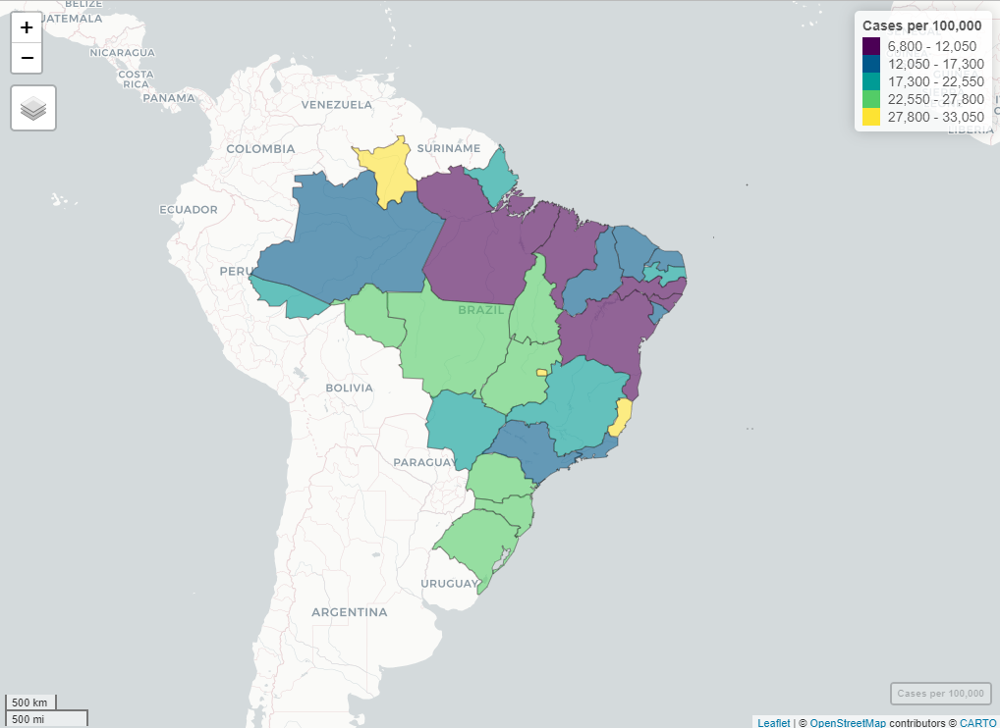
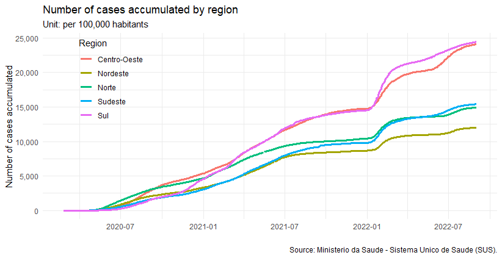
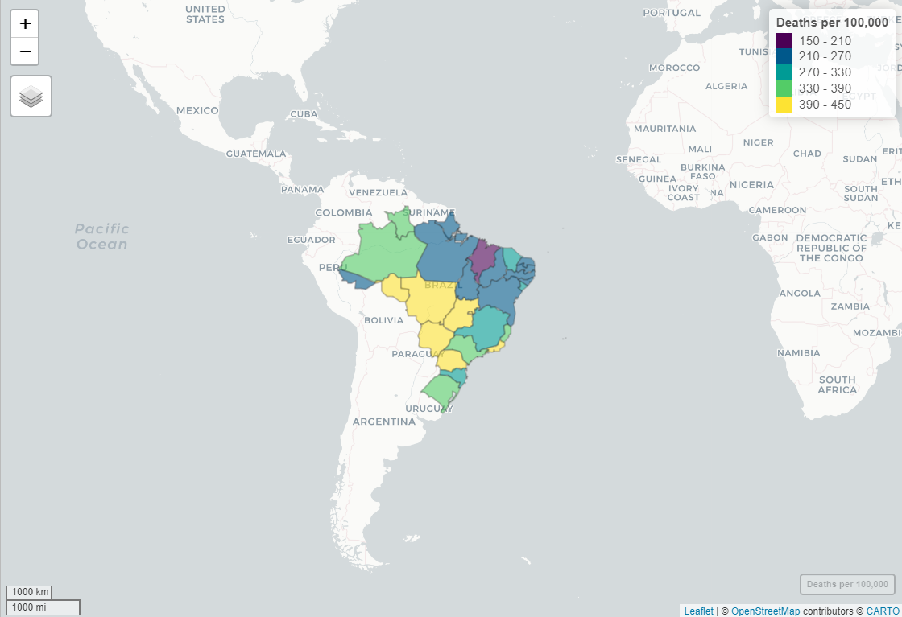
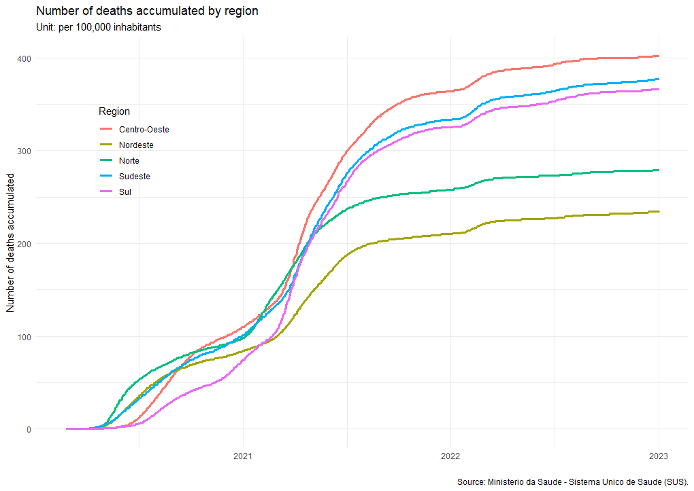
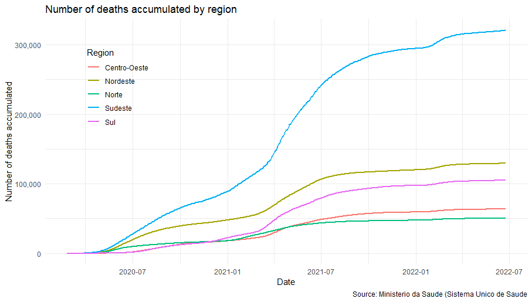
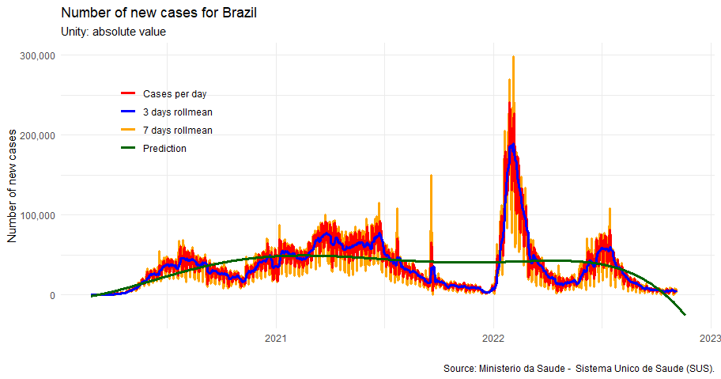
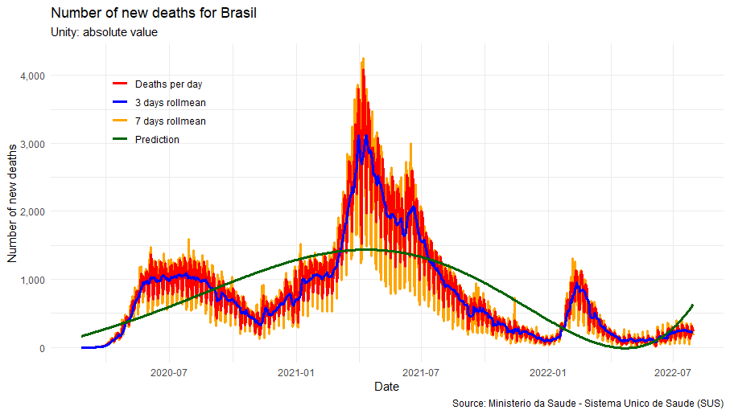

<!-- README.md is generated from README.Rmd. Please edit that file -->

```{r, include = FALSE}
library (covid19brazil)

knitr::opts_chunk$set (
	collapse = TRUE,
	comment = "#",
	fig.path = "man/figures/README-",
	out.width = "100%"
	)
```

# covid19brazil

<!-- badges: start -->

[](https://github.com/AlexandreLoures/covid19brazil/actions)
[](https://cran.r-project.org/package=covid19brazil)
[](https://lifecycle.r-lib.org/articles/stages.html)
[](https://opensource.org/licenses/MIT)
[](https://github.com/AlexandreLoures/covid19Brazil/commit/main)
[](https://cran.r-project.org/package=covid19brazil)
<!-- badges: end -->

The `covid19brazil` R package has daily information on the number of accumulated cases and accumulated deaths for the COVID-19 pandemic in Brazil. The information available in the package is organized as follows:

* `brazil_total` - Dataset with information about the new Coronavirus (COVID-19) for Brazil as a whole
* `brazil_region` - Dataset with information on the new Coronavirus (COVID-19) for the five regions of Brazil
* `brazil_state` - Information on the new Coronavirus (COVID-19) for the twenty-seven Federative Units of Brazil
* `brazil_municipality` - Information on the new Coronavirus (COVID-19) for the 5,570 municipalities in Brazil

## Base limitation:

**At the municipal level, the current day's data may be lower than the previous day's: this happens because the notification municipality is not necessarily the same place of residence of the notified case or death. Thus, upon completing the investigation process of each individual occurrence, the Municipal and State Health Departments have the autonomy to correct the information and pass it on to the Ministry of Health. Therefore, in all bases the current day's data may be smaller than the previous day's data.**

# Installation

To install the `package`, one of the two standard methods for installing `packages`in R can be adopted. Directly through the [cran](https://cran.r-project.org/package=covid19brazil) (choosing the closest repository):

``` r
install.packages ("covid19brazil")
```

Or even using the command below. In the latter case, the latest version of the `package` will be installed.

``` r
# install.packages ("devtools")
devtools::install_github ("AlexandreLoures/covid19brazil")
```
# The update_data command

To obtain the most up-to-date version of the data on the new coronavirus (COVID-19) pandemic in Brazil, use the `update_data` command. Data is updated daily on [Github (Dev) version](https://github.com/AlexandreLoures/covid19brazil), however, the [CRAN version](https://cran.r-project.org/package=covid19brazil) of the `covid19brazil` package is updated every month or two. **Don't forget to restart the R session to load the new data**.

```r
update_data ()
```

# Using the package

```{r}
data ("brazil_total")

head (brazil_total)
```

# Download, read and analyze the microdata

The purpose of this section is to analyze data on cases, deaths, proportions and geographic distribution on the COVID-19 pandemic in Brazil, made available by the [Ministerio da Saude - Sistema Unico de Saude (SUS)](https://www.gov.br/saude/pt-br). Data are available as of 2020-01-30, when the first suspected case appeared in Brazil.

## Cases accumulated per 100,000 habitants

The graph below shows the number of cases accumulated in each Federative Unit of Brazil per 100,000 habitants (data for the day 2022-08-15).

Data source: [Ministerio da Saude - Sistema Unico de Saude (SUS)](https://www.gov.br/saude/pt-br)

 \ 

Below is the graph for the number of cases accumulated per 100,000 habitants for each of the five macro-regions in Brazil.



## Deaths accumulated per 100,000 habitants

In turn, the next graph shows the number of deaths accumulated in each Federative Unit of Brazil per 100,000 habitants (data for the day 2022-08-15).

Data source: [Ministerio da Saude - Sistema Unico de Saude (SUS)](https://www.gov.br/saude/pt-br)

 \ 

The graph below shows the number of accumulated deaths per 100,000 habitants for each of Brazil's five macro-regions.



<!-- 

```r
library (ploty)

plot_ly(data = brazil_total,
        x = ~ date,
        y = ~home_confinement, 
        name = 'Home Confinement', 
        fillcolor = '#FDBBBC',
        type = 'scatter',
        mode = 'none', 
        stackgroup = 'one') %>%
  add_trace( y = ~ hospitalized_with_symptoms, 
             name = "Hospitalized with Symptoms",
             fillcolor = '#E41317') %>%
  add_trace(y = ~intensive_care, 
                name = 'Intensive Care', 
                fillcolor = '#9E0003') %>%
  layout(title = "Number of cases accumulated by region",
         legend = list(x = 0.8, y = 0.9),
         yaxis = list(title = "Number of Cases"),
         xaxis = list(title = "Source: Ministerio da Saude (Sistema Unico de Saude"))
```


```r
p <- plot_ly(data = brazil_total,
        x = ~ date,
        y = ~home_confinement, 
        name = 'Home Confinement', 
        fillcolor = '#FDBBBC',
        type = 'scatter',
        mode = 'none', 
        stackgroup = 'one') %>%
  add_trace( y = ~ hospitalized_with_symptoms, 
             name = "Hospitalized with Symptoms",
             fillcolor = '#E41317') %>%
  add_trace(y = ~intensive_care, 
                name = 'Intensive Care', 
                fillcolor = '#9E0003') %>%
  layout(title = "Number of deaths accumulated by region",
         legend = list(x = 0.8, y = 0.9),
         yaxis = list(title = "Number of Deaths"),
         xaxis = list(title = "Source: Ministerio da Saude (Sistema Unico de Saude"))
```



-->

## Moving averages and forecast (Polynomial interpolation)

<!--
```r
library (ploty)

plot_ly(data = brazil_total,
        x = ~ date,
        y = ~home_confinement, 
        name = 'Home Confinement', 
        fillcolor = '#FDBBBC',
        type = 'scatter',
        mode = 'none', 
        stackgroup = 'one') %>%
  add_trace( y = ~ hospitalized_with_symptoms, 
             name = "Hospitalized with Symptoms",
             fillcolor = '#E41317') %>%
  add_trace(y = ~intensive_care, 
                name = 'Intensive Care', 
                fillcolor = '#9E0003') %>%
  layout(title = "Number of cases accumulated by region",
         legend = list(x = 0.8, y = 0.9),
         yaxis = list(title = "Number of Cases"),
         xaxis = list(title = "Source: Ministerio da Saude (Sistema Unico de Saude"))
```
-->
The graph below presents the data for the number of daily new Covid-19 cases for Brazil, a 3-day moving average, a 7-day moving average and the forecast, obtained by polynomial interpolation of degree 5, covering the entire period plus 15 days.

 \ 

<!--

```r
p <- plot_ly(data = brazil_total,
        x = ~ date,
        y = ~home_confinement, 
        name = 'Home Confinement', 
        fillcolor = '#FDBBBC',
        type = 'scatter',
        mode = 'none', 
        stackgroup = 'one') %>%
  add_trace( y = ~ hospitalized_with_symptoms, 
             name = "Hospitalized with Symptoms",
             fillcolor = '#E41317') %>%
  add_trace(y = ~intensive_care, 
                name = 'Intensive Care', 
                fillcolor = '#9E0003') %>%
  layout(title = "Number of deaths accumulated by region",
         legend = list(x = 0.8, y = 0.9),
         yaxis = list(title = "Number of Deaths"),
         xaxis = list(title = "Source: Ministerio da Saude (Sistema Unico de Saude"))
```
-->

The next graph presents the data for the number of new daily deaths caused by Covid-19 for Brazil, a 3-day moving average, a 7-day moving average and the forecast, obtained by polynomial interpolation of degree 5, covering the entire period plus 15 days.


