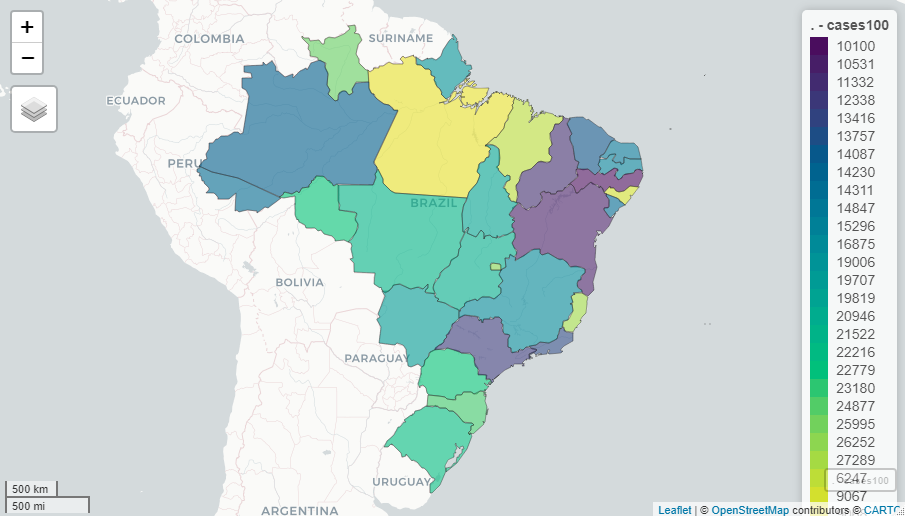

<!-- README.md is generated from README.Rmd. Please edit that file -->

```{r, include = FALSE}
library (covid19brazil)

knitr::opts_chunk$set (
	collapse = TRUE,
	comment = "#",
	fig.path = "man/figures/README-",
	out.width = "100%"
	)
```

# covid19brazil

<!-- badges: start -->

[](https://cran.r-project.org/package=covid19brazil)
[](https://lifecycle.r-lib.org/articles/stages.html)
[](https://opensource.org/licenses/MIT)
[](https://github.com/AlexandreLoures/covid19Brazil/commit)
[](https://cran.r-project.org/web/packages/covid19brazil/index.html)
<!-- badges: end -->

The `covid19brazil` R package has daily information on the number of accumulated cases and accumulated deaths for the COVID-19 pandemic in Brazil. The information available in the package is organized as follows:

* `brazil_total` - Dataset with information about the new Coronavirus (COVID-19) for Brazil as a whole
* `brazil_region` - Dataset with information on the new Coronavirus (COVID-19) for the five regions of Brazil
* `brazil_state` - Information on the new Coronavirus (COVID-19) for the twenty-seven Federative Units of Brazil
* `brazil_municipality` - Information on the new Coronavirus (COVID-19) for the 5,570 municipalities in Brazil

The graph below shows the number of cases accumulated in each Federative Unit of Brazil per 100,000 inhabitants (data for the day 2022-06-24).

Data source: [Ministerio da Saude - Sistema Unico de Saude (SUS)](https://www.gov.br/saude/pt-br)



# Installation

To install the `package`, one of the two standard methods for installing `packages`in R can be adopted. Directly through the [cran](https://cran.r-project.org/package=covid19brazil) (choosing the closest repository):

``` r
install.packages ("covid19brazil")
```

Or even using the command below. In the latter case, the latest version of the `package`will be installed.

``` r
# install.packages ("devtools")
devtools::install_github ("AlexandreLoures/covid19brazil")
```
# Using the package

```{r}
data ("brazil_total")

head (brazil_total)
```

# Analyzing the dataset
